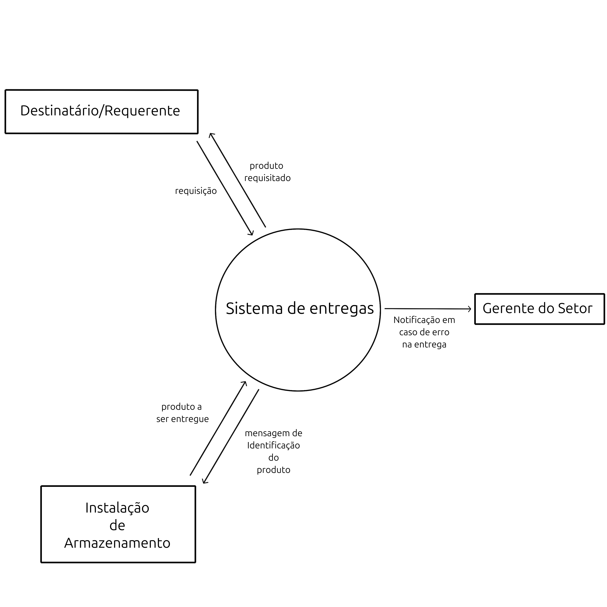
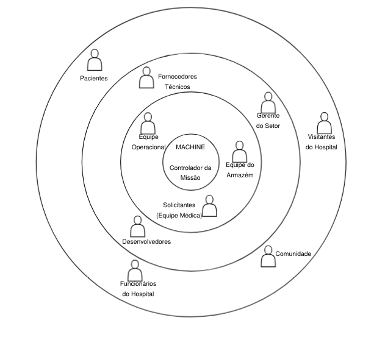
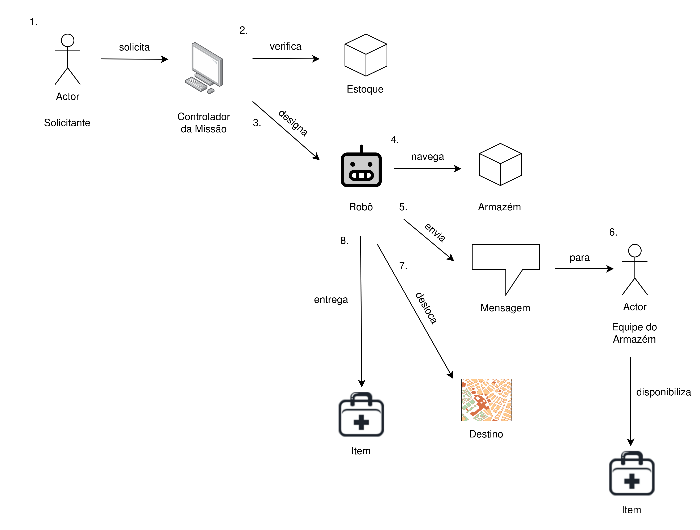
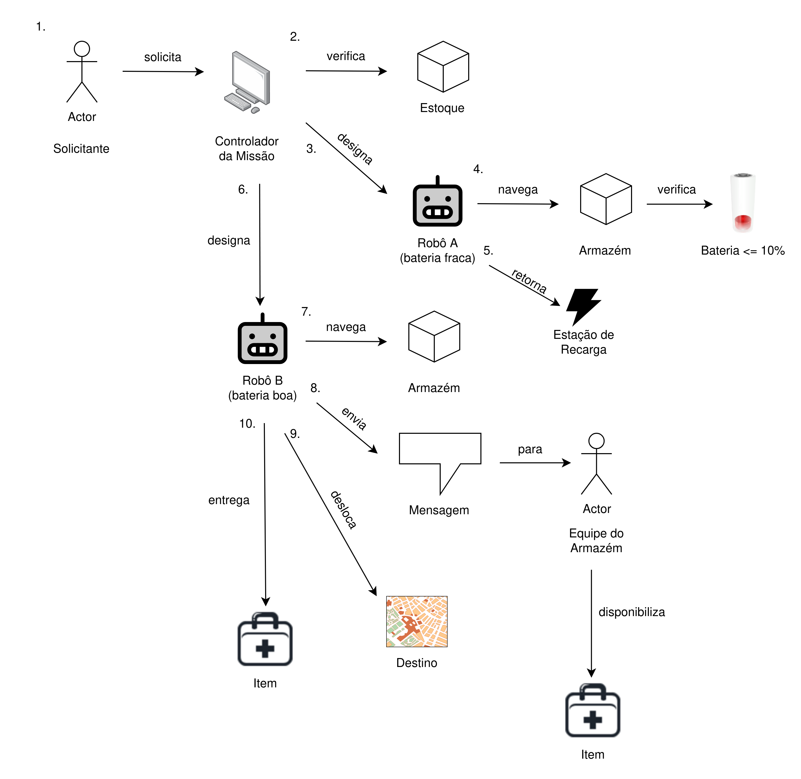
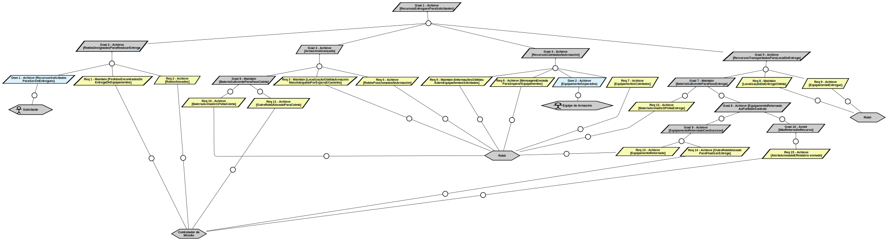
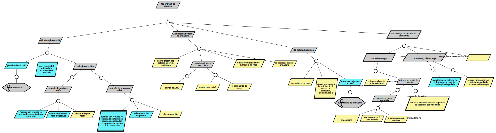

### Universidade de Brasília
#### Instituto de Ciências Exatas
#### Departamento de Ciência da Computação
#### Sistemas de Informação - 2025.2

# Trabalho Final

### Dupla 14:
#### Júlia Paulo Amorim - 241039270
#### Rafael Monteiro Ximenes de Vasconcelos - 241002402 

# 1. Introdução

> Missão B: Entregar mercadorias/equipamentos
>
> Quando necessário, um robô deve coletar os recursos requisitados no estoque e entregá-los ao agente
solicitante em um local especificado. Na fase de coleta, o robô deve ir aos locais de armazenamento onde
os recursos podem ser encontrados. A ordem a ser seguida é definida pela estimativa do tempo de espera
somado ao caminho que o robô deve percorrer. Assim que o robô chega a um local de armazenamento e
é o momento de solicitar o recurso, o robô envia uma mensagem para o estoque com a especificação
precisa dos recursos solicitados e aguarda até que os recursos sejam coletados. Uma vez coletados,
começa a fase de entrega. Nessa fase, o robô fará o número necessário de viagens para levar todos os
recursos ao local especificado. Se a bateria do robô designado estiver baixa (10%) na fase de coleta, o
robô retornará à estação de recarga e atribuirá a missão a outro robô. Se a bateria do robô designado
estiver baixa (30%) na fase de entrega, o robô deverá retornar o recurso a um ponto de controle e atribuir
a tarefa restante a outro robô, que saberá onde o recurso está posicionado. Em caso de falha ao retornar
o recurso para o ponto de controle, um alerta deve ser acionado e o relatório enviado ao gerente do setor.
Quando múltiplos itens forem necessários de diferentes estoques, múltiplos robôs podem ser designados
para tarefas paralelas de coleta e entrega, a fim de reduzir o tempo para concluir a missão. Exemplos de
mercadorias/equipamentos incluem: (i) equipamentos médicos estéreis, que devem ser transportados
de instalações estéreis para os destinos de uso, e (ii) roupas de cama limpas, que devem ser movidas
periodicamente da lavanderia para os quartos de armazenamento próximos ao local de uso.

### 1.1 - Contexto do Problema
Um grande problema contemporâneo é a logística de transporte materiais, especialmente de items críticos para hospitais como equipamentos médicos estéreis e roupas de cama limpas. A necessidade de eficiência operacional, combinada com requisitos de esterilidade e periodicidade, exige soluções que minimizem interferência humana em processos de entrega.

Neste Contexto, a Missão B surge como um problema de automação logística de um sistema de entregas para um solicitante, onde robôs autônomos devem realizar coleta e entrega de recursos de forma segura, eficiente e confiável. O sistema operaa em um ambiente com múltiplos atores, restrições físicas e condições variáveis.

### 1.2 - Descrição do Problema
O problema consiste em um sistema robótico autônomo para entrega de materiais e equipamentos, caracterizado por:

- Pedido: Um solicitante faz um pedido para um controlador da missão, que inicia o processo alocando robôs
- Coleta: Deslocamento do robô até os locais de armazenamento e destino com rotas baseadas em tempo de espera + distância
- Comunicação: Interação padronizada com mensagens para saber a disponibilidade de estoque e alocação
- Entrega: Transporte até o local de destino com múltiplas viagens quando necessário
- Paralelismo: Coordenação de múltiplos robôs para execução paralela de uma entrega
- Tratamento de erros: Possui mecanismos de falha para pouca bateria dos robôs e recuperação de equipamentos

### 1.3 - Objetivo Principal
O objetivo principal do sistema e da missão é a entrega de mercadorias e equipamentos de forma autônoma, maximizando a eficiência e confiabilidade do transporte, assim melhorando a utilização dos recursos pelo solicitante

# 2. Fundamentação Teórica

# 3. Modelagens
## Fase 1: Initiation
- ### Context Diagram

A imagem consiste em um "Context Diagram" no qual se descreve o trabalho (Work) que o sistema de entregas robótico deve realizar. Vale notar que o diagrama não especifica de que forma o trabalho deve ser executado nem o funcionamento
interno do serviço, ele apenas descreve as manifestações externas e os efeitos provenientes da sua realização sobre os atores diretamente afetados por ele.

Assim, o diagrama em questão poderia representar o serviço de entregas tanto antes da sua automação por meio de robôs 
(The World-as-is) quanto depois dela (The World-to-be). Essa é uma característica típica do que se convencionou denominar "project-level context diagram" ou "diagrama de contexto a nível de projeto", em tradução livre.

- ### Stakeholder Onion Diagram

O Stakeholder Onion Diagram foi elaborado para visualizar claramente os diferentes níveis de envolvimento, influência e impacto das diversas partes no sistema, permitindo identificar os principais atores do sistema, garantir que todas perspectivas sejam consideradas e compreender as necessidades e expectativas

- Camadas:
    1. Núcleo:
        - Controlador da Missão
    2. Anel Interno: Operadores diretos
        - Equipe Operacional
        - Solicitantes (Equipe Médica)
        - Equipe do Armazém
    3. Anel Médio: Suporte e Infraestrutura
        - Fornecedores técnicos
        - Desenvolvedores
        - Gerente do setor
    4. Anel Externo: Impactados e Reguladores
        - Pacientes
        - Visitantes do Hospital
        - Funcionários do Hospital
        - Comunidade

## Fase 2: Investigation
- ### Domain Scenarios

Cenário 1: Entrega Normal de Item Médico

- Actors:
    - Solicitante
    - Sistema de Controle de Missões
    - Robô
    - Equipe do Armazém

- World Objects:
    - Item médico
    - Estoque
    - Armazém
    - Destino

- Actions and Steps:
    1. Solicitante solicita o equipamento através do sistema
    2. Sistema de Controle recebe a solicitação e verifica disponibilidade no estoque do Armazém
    3. Sistema designa Robô para a missão
    4. Robô navega até o Armazém usando o caminho mais rápido
    5. Ao chegar, Robô envia mensagem para Equipe do Armazém
    6. Equipe do Armazém confirma e carrega o item no robô
    7. Robô inicia fase deslocamento para o destino
    8. Robô entrega o item no local

Cenário 2: Bateria Baixa na Fase de Coleta

- Actors:
    - Solicitante
    - Sistema de Controle de Missões
    - Robô A
    - Robô B

- World Objects:
    - Item
    - Estoque
    - Destino
    - Estação de recarga

- Actions and Steps:
    1. Solicitante solicita item médico
    2. Sistema controlador verifica disponibilidade no Armazém
    2. Sistema designa Robô A (bateria fraca)
    3. Durante navegação para Armazém, bateria cai para menos de 10%
    4. Robô navega até Armazém e o sistema detecta bateria menor que 10%
    5. Robô A interrompe missão e retorna à estação de recarga mais próxima
    6. Sistema automaticamente atribui missão a Robô B (bateria boa)
    7. Robô B navega para Armazém
    8. Robô B envia mensagem para Equipe do Armazém que coleta o Item
    9. Desloca até o Destino
    10. Completa entrega no Destino

- ### Goal Model (v1)

## Fase 3: Decision
- ### Impact Map

- ### Goal Model (v2)

## Fase 4: Formulation
- ### Specification by Example

- ### Goal Model (vFinal)

# 4. Conclusões

# 5. Referências
 - ROBERTSON, Suzanne; ROBERTSON, James. Mastering the Requirements Process: Getting Requirements Right, 2012

 - VAN LAMSWEERDE, Axel. Requirements Engineering: From System Goals to UML Models to Software Specifications, 2009

 - HOFER, Stefan; SCHWENTNER, Henning. Domain Storytelling: A Collaborative, Visual, and Agile Way to Build Domain-Driven Software, 2021

 - ALEXANDER, Ian; MALDEN, Neil. Scenarios, Stories, Use Cases: Through the Systems Development Life-Cycle, 2004

 - ADZIC, Gojko. Making a big impact with software products and projects, 2012

 - PATTON, Jeff; ECONOMY, Peter. User Story Mapping: Discover the Whole Story, Build the Right Product, 2014

 - ROSE, Seb; NAGY, Gáspár. Formulation: Express examples using Given/When/Then, 2012